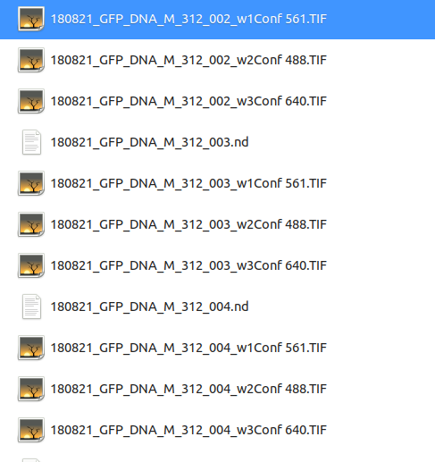
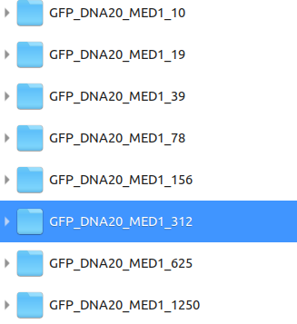
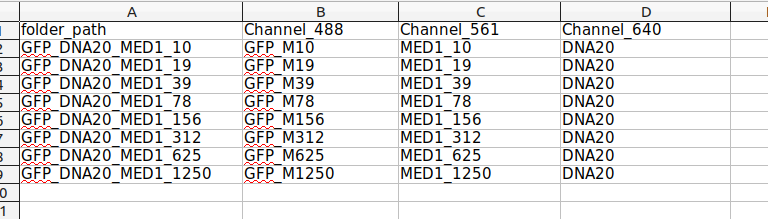

# Organizing your image files

## Overall folder organization

*  Parent folder
  * Experimental_condition_1
    * Image_replicate_001_channel1.TIF
    * Image_replicate_001_channel2.TIF
    * Image_replicate_002_channel1.TIF
    * Image_replicate_002_channel2.TIF

      ...
     * Image_replicate_015_channel2.TIF

  * Experimental_condition_2

    ...

  * Experimental_condition_N
  * data_information.xlsx

## Single folder = 1 unique experimental condition

* A single folder should contain all replicates for a given experimental condition.
* Replicates should have the following file syntax:

  * (meta-data)\_(unique replicate)\_(\_w)\_(wave-length information)

  * Example of 3 replicates imaged across 3 channels with unique IDs **002** to **004**.
  

## Single parameter sweep = List of folders

All the different experimental conditions should be under a parent folder with an **excel file** outlying important data.

* Example organization of a MED1-IDR concentration sweep shown below:

* data_information.xlsx contains 4 columns:

  * folder_path - Lists all relevant folders (see previous image)

  * Channel_number -  Gives name to channel, not required to be unique. If a file doesn't exist in a channel, leave the cell blank.

  ***Examples***
  
